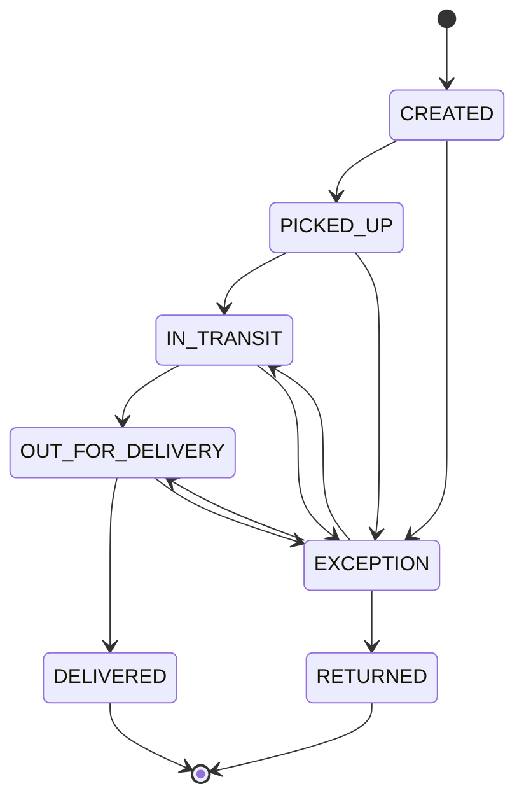

# Cargo Tracking API

REST API for cargo tracking driven by a finite-state machine: each event validates the transition before mutating the shipment status, and the full timeline is persisted.

[](https://github.com/<owner>/<repo>/actions/workflows/ci.yml)
[](https://github.com/<owner>/<repo>/actions/workflows/codeql.yml)

## Overview

A shipment moves through a constrained graph of statuses. Every `POST /events` evaluates whether the requested status is reachable from the current one — invalid transitions are rejected with `409 Conflict` and nothing is written. Valid transitions atomically update the aggregate status and append an immutable `TrackingEvent` to the timeline.

## State machine



`EXCEPTION` is the only recoverable state and the only path to `RETURNED`. `DELIVERED` and `RETURNED` are terminal — no further events are accepted.

## Stack

Java 21 · Spring Boot 3.5 · Spring Web · Spring Data JPA + PostgreSQL · Bean Validation · Spring Security (API key) · Flyway · springdoc-openapi · JUnit 5 + Testcontainers · Maven · Docker · GitHub Actions · Railway.

## Architectural decisions

- Rich domain model — the transition guard lives inside the aggregate (`Shipment.addEvent`), not in the service.
- State machine as data — `EnumMap<ShipmentStatus, Set<ShipmentStatus>>` inside `ShipmentStatus`; no `if`/`switch`, no Spring StateMachine.
- Optimistic locking — `@Version` on the aggregate; concurrent updates surface as `409 Conflict`.
- Flyway owns the schema — Hibernate runs with `ddl-auto=validate`; mismatches fail at boot.
- RFC 7807 errors — all error responses are `application/problem+json` via Spring's native `ProblemDetail`.
- Stateless API-key auth — single `X-API-Key` header; time-constant comparison; no sessions.
- Real Postgres in tests — Testcontainers (singleton `postgres:16-alpine`); the full transition matrix (49 pairs) is asserted exhaustively.

## API

All routes are namespaced under `/api/v1` and require the `X-API-Key` header, except `/swagger-ui/**`, `/v3/api-docs/**` and `/actuator/health`.

| Method | Path | Purpose | Status |
|---|---|---|---|
| POST | `/api/v1/shipments` | Create shipment (server generates `trackingCode`) | 201 / 400 |
| GET  | `/api/v1/shipments/{id}` | Fetch by id | 200 / 404 |
| GET  | `/api/v1/shipments?status=&page=&size=` | Paginated list (optional status filter) | 200 / 400 |
| POST | `/api/v1/shipments/{id}/events` | Append event (validates transition) | 201 / 400 / 404 / 409 |
| GET  | `/api/v1/shipments/{id}/timeline` | Current status + ordered events | 200 / 404 |

Interactive docs: `http://localhost:8080/swagger-ui.html`.

## Running locally

Prerequisite: Docker.

```bash
docker compose up --build
```

| Env var | Purpose | Compose default |
|---|---|---|
| `SPRING_DATASOURCE_URL`       | JDBC URL                | `jdbc:postgresql://postgres:5432/tracking` |
| `SPRING_DATASOURCE_USERNAME`  | DB user                 | `tracking` |
| `SPRING_DATASOURCE_PASSWORD`  | DB password             | `tracking` |
| `APP_API_KEY`                 | Single API key (header) | `local-dev-api-key` |

Swagger: <http://localhost:8080/swagger-ui.html> — click Authorize and paste the API key.

### Example flow

```bash
API=http://localhost:8080
KEY="X-API-Key: local-dev-api-key"

# 1) Create
ID=$(curl -s -X POST "$API/api/v1/shipments" \
  -H "$KEY" -H "Content-Type: application/json" \
  -d '{"origin":"São Paulo","destination":"Curitiba","recipientName":"Alice"}' \
  | jq -r .id)

# 2) Valid transition: CREATED -> PICKED_UP
curl -s -X POST "$API/api/v1/shipments/$ID/events" \
  -H "$KEY" -H "Content-Type: application/json" \
  -d '{"status":"PICKED_UP","location":"Warehouse SP","occurredAt":"2026-06-02T10:00:00-03:00"}'

# 3) Invalid transition: CREATED -> DELIVERED (would skip stages) -> 409
curl -s -i -X POST "$API/api/v1/shipments/$ID/events" \
  -H "$KEY" -H "Content-Type: application/json" \
  -d '{"status":"DELIVERED","occurredAt":"2026-06-02T10:05:00-03:00"}'
# HTTP/1.1 409
# Content-Type: application/problem+json
# {"title":"Invalid state transition","detail":"Cannot transition from PICKED_UP to DELIVERED",...}

# 4) Timeline
curl -s "$API/api/v1/shipments/$ID/timeline" -H "$KEY"
```

## Tests

```bash
./mvnw verify                 # unit + integration (Testcontainers; needs Docker)
./mvnw -Psecurity verify      # adds OWASP dependency-check; needs NVD_API_KEY env var
```

`-Psecurity` triggers the NVD download — first execution is slow even with a key.

## CI/CD

- `ci.yml` — `build-test` runs `./mvnw -B verify` (unit + IT). `dependency-check` runs `./mvnw -B -Psecurity -DskipTests verify` with a cached NVD database and uploads the SARIF report via `github/codeql-action/upload-sarif` (`if: always()`, so the report ships even when `failBuildOnCVSS=7` fails the job). `NVD_API_KEY` is consumed from repo secrets.
- `codeql.yml` — runs on push/PR to `main` and every Monday 06:00 UTC; standard `init → autobuild → analyze` chain.

## Deploy on Railway

1. New project → Deploy from GitHub repo. Railway picks up the `Dockerfile` automatically.
2. Add a PostgreSQL service to the project.
3. On the app service, set the variables:
   ```
   SPRING_DATASOURCE_URL=jdbc:postgresql://${{Postgres.PGHOST}}:${{Postgres.PGPORT}}/${{Postgres.PGDATABASE}}
   SPRING_DATASOURCE_USERNAME=${{Postgres.PGUSER}}
   SPRING_DATASOURCE_PASSWORD=${{Postgres.PGPASSWORD}}
   APP_API_KEY=<strong-secret>
   ```
   Replace `Postgres` with the actual DB service name. Railway injects `PORT`; the app binds to `${PORT:8080}`.
4. Settings → Networking → generate a public domain.
5. Settings → Health check path: `/actuator/health`.
6. On first boot Flyway applies the migrations and creates the schema. Swagger is exposed at `<your-domain>/swagger-ui.html`.
